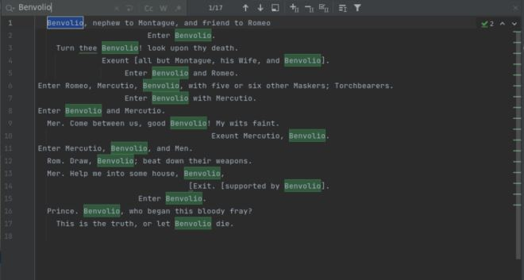

# Java Grep App

## Introduction
The purpose of this project is to automate the process of searching through multiple files in order to find
specific keywords. Given a directory, the following app searches through all the files and outputs a text file
containing all the lines that matches an inputted regex pattern. The app is developed in Java using IntelliJ Idea
and Maven as the project management tool. For better efficiency Java Stream APIs were employed. The app
was packaged using Docker for easier distribution.

## Quick Start
1. Firstly pull the Docker image from DockerHub:
```
docker pull hfathi22/grep
```

2. Use a Docker container to run the image:
```
docker run --rm \
-v `pwd`/data:/data -v `pwd`/log:/log \
hfathi22/grep {regex expression} {root path} /log/{output filename}
```
regex expression: the search pattern you are filtering for

root path: the directory that contains all the files you want to search

output filename: the name of the output file generated (NOTE: the output file is generated inside the 
log directory)

## Implementation
### Pseudocode
The `process` method is a high-level overview of the implementation of the grep app. The method calls
the helper functions which contains the detailed implementation. The Pseudocode for the process method
is shown below:
```
matchedLines = []
for file in listFilesRecursively(rootDir)
  for line in readLines(file)
      if containsPattern(line)
        matchedLines.add(line)
writeToFile(matchedLines)
```

### Performance Issue
Since Java allocates the heap memory size prior to the execution of the program, an `OutOfMemoryError`
might be thrown when dealing with large amounts of files, causing the app to crash. To fix this issue,
Java Stream APIs were used instead of the conventional "for" loop. Java Stream APIs employ what is called
lazy loading such that data is cleared from the memory when they are no longer needed, allowing the grep
app to process a larger amount of data with lower heap memory size.

## Testing
Testing was done manually on a sample text file using multiple regex expressions as inputs. The results were later
compared with the Linux grep command output to confirm the accurate behavior of the app. Below is the output
text file obtained when the word "Benvolio" is passed as the regex expression (the text file
employed in this case contains all the plays written by William Shakespeare):



## Deployment
To ensure easier distribution, the app was deployed as a Docker file on DockerHub. Maven was used to 
package the project including all the dependencies required to run the app. 

## Improvements
* Currently, the app searches files in a single given directory. The following can be extended to 
include multiple directories as well as nested directories
* Include the rest of the grep functionality such printing the line number alongside the output lines as well as the total number of matches.
* Implement better error handling, in order to ensure easier debugging experience for the user.
