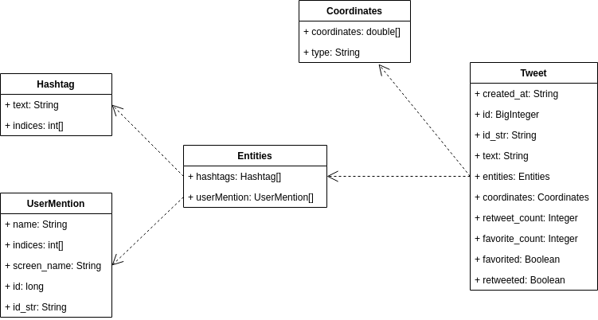

#Twitter CRD App
##Introduction
The Twitter CRD app provides a way to CRD (Create, Read and Delete) tweets through a CLI by calling
the Twitter REST API. Twitter API keys obtained from the Twitter Developer account are required
to use the app. The application was developed using Java and structured with Maven and Springboot.
In addition, Mockito and JUnit were used for unit and integration testing. Deployed using Docker 
and is available on DockerHub.

##Quick Start
1. Firstly, pull the Docker image from DockerHub:
```
docker pull hfathi22/twitter
```

2. Use a Docker container to run the image and provide the environment variables which can
be obtained from the Twitter Developer account:
```
docker run --rm \
-e consumerKey=YOUR_VALUE \
-e consumerSecret=YOUR_VALUE \
-e accessToken=YOUR_VALUE \
-e tokenSecret=YOUR_VALUE \
hfathi22/twitter post|show|delete [options]
```
After the environment variables has been set, any of the following actions can be performed: 
**post**, **show** or **delete** a tweet

**Post**: requires the Tweet text and location coordinates to be passed as arguments:
```
docker run hfathi22/twitter post "tweet_text" latitude:longitude
```

**Show**: requires the corresponding Tweet ID to be passed as an argument and an optional fields argument 
which is used to show only the specified fields of the Tweet object:
```
docker run hfathi22/twitter show tweet_id field_name_1,field_name_2,field_name_3...
```

**Delete**: required the Tweet IDs to be passed as an argument. Multiple Tweet can be deleted 
by passing the corresponding Tweet IDs seperated by a comma:
```
docker run hfathi22/twitter delete tweet_id_1,tweet_id_2,tweet_id_3...
```

##Design
###UML Diagram


The five major implementation components are:

* **TwitterCLIApp.java**
> This file receives the arguments inputted by the user and passes them to the controller layer. 
> The environment variables (Twitter keys and tokens) are handled here and passed to the HttpHelper to 
> create the connection with the Twitter API. The app dependencies are also created here 
> which are managed by Spring.

* **TwitterController.java**
> In this file the user arguments are parsed and passed on to the Service layer. The results are
> returned to be displayed for the user

* **TwitterService.java**
> This file handles the business logic and ensures that the user arguments are valid. For instance, it 
> checks if Tweet ID is in the correct format when reading/deleting and the text does not exceed the 
> character limit (140 characters).

* **TwitterDao.java**
> This layer constructs the URI which is used to make the HTTP requests to the Twitter API 
> in the `TwitterHttpHelper.java` file. It also deserializes the response received from the 
> Twitter API

* **TwitterHttpHelper.java**
> This file makes the HTTP request (create, read or delete a Tweet) to the Twitter API using the URI sent from the `TwitterDao.java`
> file.

###Models
The figure below shows the models used in this app. The Tweet model depends on four other models.



###Spring
Spring framework was employed in this app for dependency management which helps avoid the manual,
error-prone setup of dependencies within the Java application. Spring uses annotations such as `@Component` and
its specializations: `@Service`, `@Repository` and `@Controller` to mark what are called 
beans which are managed by the IoC container. The IoC container injects those dependencies 
when it creates the bean.

##Testing
Unit testing as well as integration testing were employed to test all the functionalities of 
the Twitter Application. 

**JUnit** was used to control test class workflow. For each `@Test` case/method, Assertion was
used to compare the actual result with the expected result.

**Mockito** was used for Unit testing to test the individual classes in isolation. This is
done by mocking the class dependencies such that they return the expected result when they
are called.

Below are sample outputs obtained for the post, show and delete commands:

###Sample Post Output


###Sample Show output
Show below is a Tweet posted by Lebron James:


###Sample Delete output
The Tweet posted previously containing the "test" text is now deleted.


##Deployment
To ensure easier distribution, the app was deployed as a Docker image on DockerHub. The image
can be pulled using the docker command on the CLI `docker pull hfathi22/twitter`.

##Improvements
* Currently, the "show" command only shows a single Tweet at one. Including the functionality
of retrieving and showing multiple Tweets can be useful in terms of data analysis.
* Another improvement can be automating the posting of tweets based on the specified inputted time.
* The functionality of saving tweets in a database can be really effective in terms of 
further data analysis, for example through the use of machine learning models.