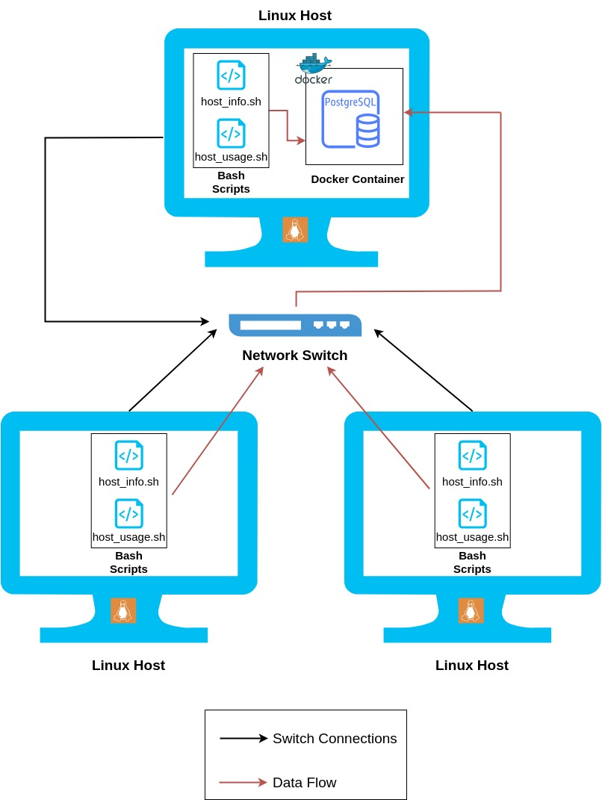
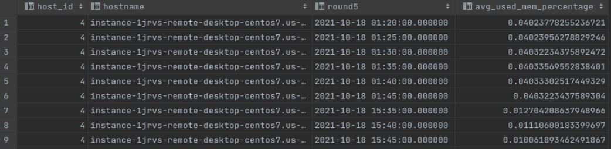

# Linux Cluster Usage Administration

## Introduction
The purpose of this project is to monitor the hardware and usage data of each linux
machine in a cluster, connected together through a network switch. 
The machine's usage data is obtained every one minute using crontab and
stored in a PostgreSQL database. A collections of SQL queries can be executed to analyze the 
machine's performace.

Technologies Used:
* Linux
* Bash
* Docker
* PostgreSQL
* GIT


## Quick Start
1. Firstly, a PSQL docker container needs to be created by running the `psql_docker.sh` script.
```bash
bash scripts/psq_docker.sh create db_username psql_password
```

2. Connect to the PSQL instance and create the database. 
```
# connect to the psql instance
psql -h localhost -U postgres -W

# create a database
postgres=# CREATE DATABASE host_agent;
```

3. Run the `ddl.sql` file to create the host_info and host_usage tables which used to store the data
```
psql -h localhost -U psql_user -d host_agent -f sql/ddl.sql
```

4. Insert the hardware data into the host_info table
```bash
bash scripts/host_info.sh psql_host psql_port db_name psql_user psql_password
```

5. Insert the usage data into the host_usage table
```bash
bash scripts/host_usage.sh psql_host psql_port db_name psql_user psql_password
```

6. `host_usage.sh` script needs to be automated with crontab in order for usage data to be collected every one minute.
``` bash
#edit the crontab job
bash> crontab -e

#add the code below to the crontab file
* * * * * bash <FULL PATH>/scripts/host_usage.sh localhost 5432 host_agent postgres password > /tmp/host_usage.log

#list crontab jobs to make sure the job is running
crontab -l
```

7. Start analyzing your machine's data by running the `queries.sql` file.
```
psql -h localhost -U psql_user -d host_agent -f sql/queries.sql
```

## Implementation
This project includes three bash scripts: `psql_docker.sh`, `host_info.sh` and
`host_usage.sh` which are used to create the PSQL docker container, collect hardware
data and collect usage data respectively. In addition, there are two sql files: `ddl.sql`
and `queries.sql` which are used to create the database tables and display useful data
respectively

### Architecture
The figure below illustrates the architecture employed for this project. The `host_info.sh` and
`host_usage.sh` bash scripts will have to be executed on all Linux hosts while the PostgresSQL
will be shared across them. The SQL queries can be executed to analyze the data.



### Scripts
The Scripts employed in this project are:

* **psql_docker.sh**
> Script to create, start or stop the PSQL docker container. PSQL environment variables such
> as username and password must be passed in to create the container.
```bash
bash scripts/psq_docker.sh create|star|stop db_username psql_password
```

* **host_info.sh**
> Script to retrieve the machine's hardware data and inserts it into the database, specifically
> the host_info table. The hostname, port number, database name, PSQL username and PSQL password
> must be passed in when calling the script.
```bash
bash scripts/host_info.sh psql_host psql_port db_name psql_user psql_password
```
* **host_usage.sh**
> Scripts to retrieve the machine's usage data and inserts it into the database, specifically
> the host_usage table. Just like the host_info script, the hostname, port number, database name,
> PSQL username and PSQL password must be passed in when calling the script.
```bash
bash scripts/host_usage.sh psql_host psql_port db_name psql_user psql_password
```

* **crontab**
> Executes the `host_usage.sh` scripts every one minute. 

* **dll.sql**
> Creates the host_info and host_usage SQL tables to store the machine's hardware data and 
> usage data respectively
```
psql -h localhost -U psql_user -d host_agent -f sql/ddl.sql
```

* **queries.sql**
> Contains a collection of SQL queries that can be useful for analyzing the machine's usage
> data
```
psql -h localhost -U psql_user -d host_agent -f sql/queries.sql
```

### Database Modelling
The data which are collected are displayed in the following two tables:


**host_info table**

|**Column Name** | **Column Description**|
|------------ | -------------|
|`id` | Unique id to identify the machine |
|`hostname` | Unique name of the machine|
|`cpu_number` | Number of CPUs the machine has|
|`cpu_architecture` | Machine's CPU architecture|
|`cpu_model` | Machine's CPU model|
|`cpu_mhz` | Machine's CPU clock speed in MHz|
|`L2_cache` | Level 2 CPU cache memory in kB|
|`total_mem` | Machine's total memory in kB|
|`"timestamp"` | The time of when the information is retrieved|

**host_usage table**

|**Column Name** | **Column Description**|
|------------ | -------------|
|`memory_free` | The memory space that is free in the machine in MB |
|`cpu_idle` | Percentage of the CPU that is available|
|`cpu_kernel` | Percentage of the CPU used by the kernel|
|`disk_io` | Number of disk I/O|
|`disk_available` | Amount of memory space available at the root directory|
|`"timestamp"` | The time of when the information is retrieved|

## Test
The following project was tested on a linux environment running the **CentOS7** distribution system. Below is an output of a query
that averages the memory usage percentage over a five minute interval.



*NOTE: FLOAT was used instead of INT for the avg_used_mem_percentage column since the values are too small*

## Deployment
* GitHub was employed for version control and GitFlow was used to manage the different branches.
* Docker was employed to create the PSQL container.
* Crontab was employed to automate the host_usage script in order to retrieve usage data every one minute.
* Intellij IDE was employed to make the bash scripts and the SQL queries.

## Improvements
* Combine the bash scripts into one file instead of having to run multiple files.
* Obtain more usage data from the machine and add more queries to analyze the machine's performance in more detail as well as 
display the output from the queries in a more readable format (i.e. for displaying system failure).
* Automatically track the hardware data, instead of having to run the host_info script everytime there are new 
changes in the host information.
